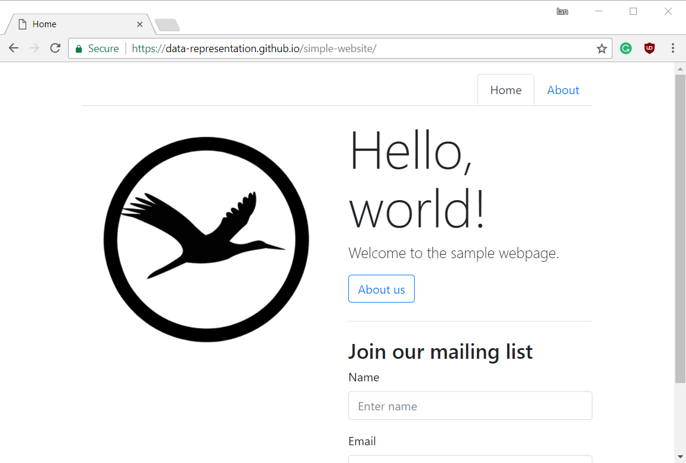
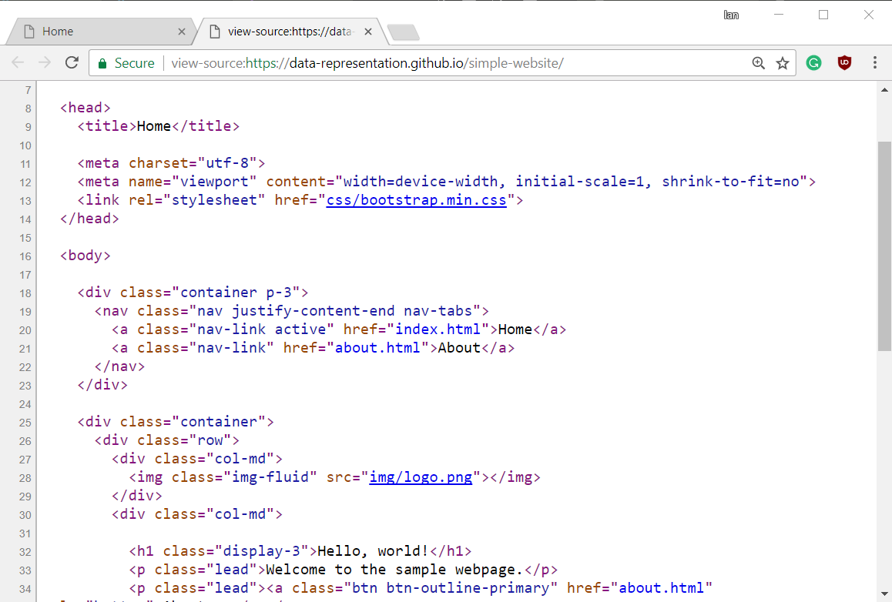
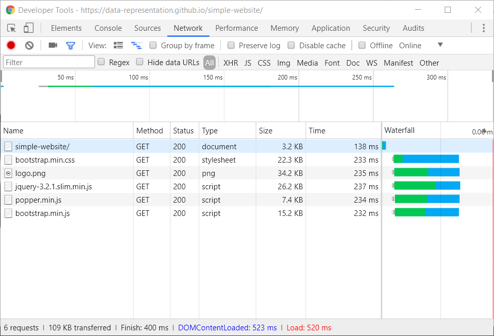
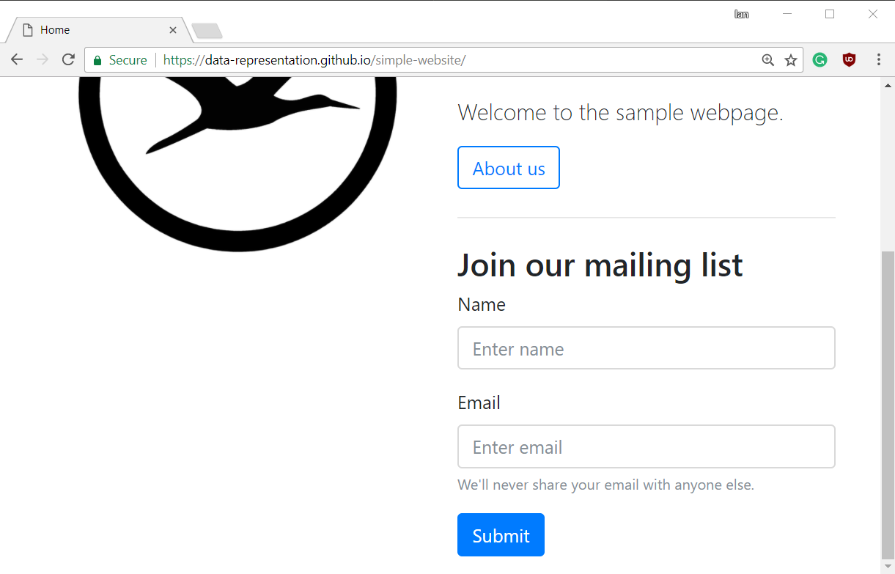

# Web browsers
The main desktop application in use today is the web browser.
In this document we explore some of its inner workings.
The main reference for the below is [How Browsers Work: Behind the scenes of modern web browsers by Tali Garsiel and Paul Irish](https://www.html5rocks.com/en/tutorials/internals/howbrowserswork/).

Many companies develop web browsers.
Google have Chrome, Mozilla have Firefox, Apple have Safari, Opera Software have Opera, and Microsoft have Edge.
These browsers have one main job, to fetch HTML and render it for the end user.
They also fetch:

- **JavaScript** which is mainly used to manipulate the HTML document,
- **CSS** which is mainly used for styling the HTML document, and
- **images** which are displayed as part of the HTML document.

#### The location bar

Consider a simple webpage like the following.



The webpage is hosted at the URL [https://data-representation.github.io/simple-website/index.html](https://data-representation.github.io/simple-website/index.html).
The user has visited the page by typing this URL into the location bar at the top of the window, and pressing enter.
The file requested is a HTML file, but what is displayed in the browser window contains images, has had some CSS applied to it from a separate CSS file, and the browser has loaded three JavaScript files.
How did all of that happen?

1. The browser sent a **request** to the server located at `data-representation.github.io` using the `HTTP` protocol on port `80` using the `GET` method, requesting the *resource* named `/simple-website/index.html`.
2. The server sent a **response** to the browser, which indicated that it had successfully located that resource with status code `200`, and the response contained the resource itself which was in the form of HTML.
3. The browser parsed the HTML, and figured out that it needed to also download an image file called `img/logo.png`, a CSS file called `css/bootstrap.min.css`, and three JavaScript files called `js/jquery-3.2.1.slim.min.js`, `js/popper.min.js`, and `js/bootstrap.min.js`.

  

4. The HTML did not tell the browser on which server to find these files, so it assumed it was the same one that `index.html` came from. For instance, it figured out that `img/logo.png` was really located at `http://data-representation.github.io/img/logo.png`.
5. The browser sent out five separate HTTP `GET` requests for each of those files, and parsed them.

  

6. As quickly as it could, it rendered the result of all six files in the browser window. Whenever possible, it did things in parallel, and without waiting for all the resources to download fully.

#### Clicking links, back buttons, and bookmarks
The procedure when a user clicks a link is the same, only for the way the initial `GET` request is initiated by the user.
Each link, assuming it is not an internal page anchor beginning with `#`, is just a URL.
When a user clicks a link, they get the same result as if they had typed the link's URL into the location bar and pressed enter.

The same applies for your browser's back button, which is just a stack of URLs previously visited.
When the back button is clicked, it's as if the user just typed the previous page's URL in the location bar.
The only caveat here is that your browser will often try remember anything you have done on the previous page as a convenience to you, such as the point to which you had scrolled in it.
If you type the URL in the location bar it tpyically won't.

Likewise, pressing the refresh button is just a convenient way of re-typing the URL in the location bar. 
Likewise, bookmarks are just links that your browser has stored that you can click on instead of typing them into the location bar.
You might notice slight differences in your own browser, depending on how you initiate it, but the result is a `GET` request being initiated by your browser for a URL.
Anything on top, like caching, of that is just a convenience your browser provides.

#### Forms
Forms are HTML elements that allow users to input information.



Until the Submit button of a form is clicked, the data only exists in the web browser's memory.
If the data is input and the Submit button is not clicked, the user can only rely on the web browser to store the data as the web server has not seen the data yet.
Once the Submit button is clicked, the mechanism is similar to clicking a link.
A HTTP request is sent to the web server.

The key difference is that the data from the form is included in the request made to the server.
The URL for the request is taken from the form tag's `ACTION` attribute.


```html
<form action="submit.html" method="GET">
  
  <label for="userEmail">Email</label>
  <input type="email" name="userEmail">
 
  <button type="submit">Submit</button>

</form>
```

In the example above, clicking the submit button will initiate a HTTP request for the resource `submit.html`.
Again, this is a relative URL, so the server from which the resource will be requested is `data-representation.github.io`.
The method of the form is `GET`, so the HTTP request will use the usual `GET` HTTP method.
The data, in this case just the value the user types in the email box, are encoded in the URL.
This means that the end part of the URL requested will be `submit.html?userEmail=myemail%40gmail.com`.
Once the request is made, the web server responds (usually) with a new resource which causes the browser to clear the currently displayed page and replace it with a new one.


A lot of forms use the `POST` method instead.
The main difference is that the data should then not be encoded in the URL, but rather should be sent in the **body** of the HTTP request.


#### AJAX

Note that most forms in modern websites and web applications use JavaScript to prevent HTTP requests from causing the browser to clear the displayed page fully.
It's common now for websites to send one single HTML page to the user's browser with some big JavaScript files included.
They have JavaScript capture all link clicks, form submissions and other user generated events.

JavaScript prevents the browser from doing what it would usually do with such interactions - clearing the page and loading a new resource in the foreground.
Rather, they use AJAX to load resources in the background and then manipulate what's currently displayed in the browser window.
To do this manipulation, they use the Document Object Model (DOM).