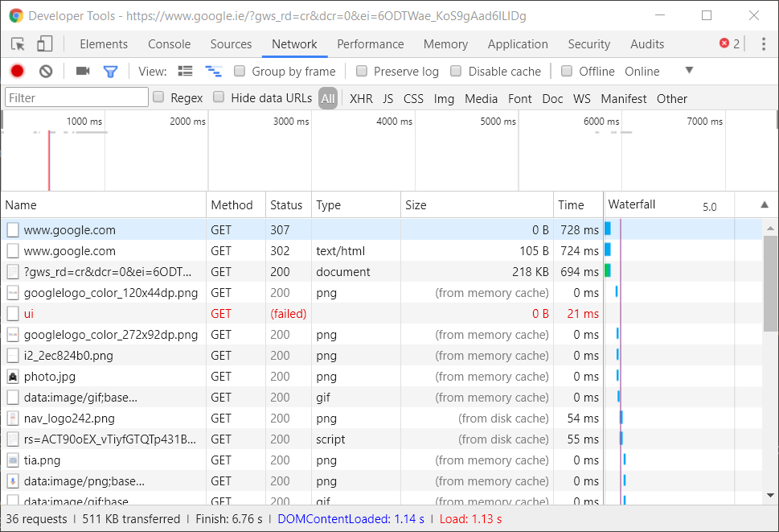

# curl and postman
Most HTTP transactions happen in the background, hidden from the user.
This is a good thing for the non-technical user, but presents a challenge for web application developers.
There are a few tools that help us to pull the transactions into view, so that they can be investigated and debugged.


## curl
curl is a command line tool (and a software library) for sending and receiving data using various protocols.
We'll use it to make HTTP requests and investigate them.


### Installation
curl is open-source and compiles on all the major platforms.
It usually comes pre-installed on Linux and MacOS.
For Windows (and other platforms), many sites online provide pre-compiled binaries.
You can download one of these using the [curl download wizard](https://curl.haxx.se/dlwiz/).

I have also made curl available on the course webpage [here](../resources/curl.zip).
If you are using [cmder](http://cmder.net/) you can place the three files in the zip directly into the bin sub-folder in cmder.
Then you will be able to run curl in cmder.


### Basic usage
curl is command line program.
If you run it without arguments you get the following.

```sh
$ curl
curl: try 'curl --help' or 'curl --manual' for more information
```

Try running `curl --help`.
You will see that curl has a huge number of command line options.

```sh
$ curl --help
Usage: curl [options...] <url>
     --abstract-unix-socket <path> Connect via abstract Unix domain socket
     --anyauth       Pick any authentication method
 -a, --append        Append to target file when uploading
     --basic         Use HTTP Basic Authentication
     --cacert <CA certificate> CA certificate to verify peer against
     --capath <dir>  CA directory to verify peer against
 -E, --cert <certificate[:password]> Client certificate file and password
     --cert-status   Verify the status of the server certificate
     --cert-type <type> Certificate file type (DER/PEM/ENG)
     --ciphers <list of ciphers> SSL ciphers to use
     --compressed    Request compressed response
 -K, --config <file> Read config from a file
     --connect-timeout <seconds> Maximum time allowed for connection
     --connect-to <HOST1:PORT1:HOST2:PORT2> Connect to host
...etc
 -T, --upload-file <file> Transfer local FILE to destination
     --url <url>     URL to work with
 -B, --use-ascii     Use ASCII/text transfer
 -u, --user <user:password> Server user and password
 -A, --user-agent <name> Send User-Agent <name> to server
 -v, --verbose       Make the operation more talkative
 -V, --version       Show version number and quit
 -w, --write-out <format> Use output FORMAT after completion
     --xattr         Store metadata in extended file attributes
```

You might also run `curl --version` and see the version information.
```sh
$ curl --version
curl 7.55.1 (x86_64-pc-win32) libcurl/7.55.1 OpenSSL/1.1.0f zlib/1.2.11 WinIDN libssh2/1.8.0 nghttp2/1.25.0
Release-Date: 2017-08-14
Protocols: dict file ftp ftps gopher http https imap imaps ldap ldaps pop3 pop3s rtsp scp sftp smtp smtps telnet tftp
Features: AsynchDNS IDN IPv6 Largefile SSPI Kerberos SPNEGO NTLM SSL libz TLS-SRP HTTP2 HTTPS-proxy
```

Let's use curl to view a webpage.
```html
$ curl https://data-representation.github.io/simple-website/index.html
<!DOCTYPE html>

<!-- Adapted from: https://v4-alpha.getbootstrap.com/getting-started/introduction/ -->
<!-- and: https://v4-alpha.getbootstrap.com/components/forms/ -->

<html lang="en">

  <head>
    <title>Home</title>

    <meta charset="utf-8">
    <meta name="viewport" content="width=device-width, initial-scale=1, shrink-to-fit=no">
    <link rel="stylesheet" href="css/bootstrap.min.css">
  </head>

  <body>

    <div class="container p-3">
      <nav class="nav justify-content-end nav-tabs">
        <a class="nav-link active" href="index.html">Home</a>
        <a class="nav-link" href="about.html">About</a>
      </nav>
    </div>

    <div class="container">
      <div class="row">
        <div class="col-md">
          </img>
        </div>
        <div class="col-md">

          <h1 class="display-3">Hello, world!</h1>
          <p class="lead">Welcome to the sample webpage.</p>
          <p class="lead"><a class="btn btn-outline-primary" href="about.html" role="button">About us</a></p>

          <hr class="my-4">

          <h3>Join our mailing list</h3>
          <form action="submit.html" method="GET">
            <div class="form-group">
              <label for="user-name">Name</label>
              <input type="text" class="form-control" id="user-name" name="user-name" aria-describedby="user-name-help" placeholder="Enter name">
            </div>
            <div class="form-group">
              <label for="user-email">Email</label>
              <input type="email" class="form-control" id="user-email" name="user-email" aria-describedby="user-email-help" placeholder="Enter email">
              <small id="user-email-help" class="form-text text-muted">We'll never share your email with anyone else.</small>
            </div>
            <div class="form-group">
              <button type="submit" class="btn btn-primary">Submit</button>
            </div>
          </form>

        </div>
      </div>
    </div>

    <script src="js/jquery-3.2.1.slim.min.js"></script>
    <script src="js/popper.min.js"></script>
    <script src="js/bootstrap.min.js"></script>
  </body>
</html>
```

So, curl has fetched the HTML page and displayed as text to us.
It hasn't downloaded any of the other resources referenced in the HTML, such as the JavaScript, CSS or image files.
If just fetched the HTML file, dumped it to the screen and quit.

### Investigating the transaction
Above, we used curl to fetch a HTML page.
In the background, curl sent a HTTP request, and received a HTTP response.
The request told the server we wanted the index.html file, and the response contained that file.
We can have curl show us the full request and full response using the `--verbose` switch.

```sh
$ curl --verbose https://data-representation.github.io/simple-website/index.html
*   Trying 151.101.37.147...
* TCP_NODELAY set
* Connected to data-representation.github.io (151.101.37.147) port 443 (#0)
* ALPN, offering h2
* ALPN, offering http/1.1
* Cipher selection: ALL:!EXPORT:!EXPORT40:!EXPORT56:!aNULL:!LOW:!RC4:@STRENGTH
* successfully set certificate verify locations:
*   CAfile: C:\Users\imcloughlin\cmder\bin\curl-ca-bundle.crt
  CApath: none
* TLSv1.2 (OUT), TLS handshake, Client hello (1):
* TLSv1.2 (IN), TLS handshake, Server hello (2):
* TLSv1.2 (IN), TLS handshake, Certificate (11):
* TLSv1.2 (IN), TLS handshake, Server key exchange (12):
* TLSv1.2 (IN), TLS handshake, Server finished (14):
* TLSv1.2 (OUT), TLS handshake, Client key exchange (16):
* TLSv1.2 (OUT), TLS change cipher, Client hello (1):
* TLSv1.2 (OUT), TLS handshake, Finished (20):
* TLSv1.2 (IN), TLS handshake, Finished (20):
* SSL connection using TLSv1.2 / ECDHE-RSA-AES128-GCM-SHA256
* ALPN, server accepted to use h2
* Server certificate:
*  subject: C=US; ST=California; L=San Francisco; O=GitHub, Inc.; CN=www.github.com
*  start date: Mar 23 00:00:00 2017 GMT
*  expire date: May 13 12:00:00 2020 GMT
*  subjectAltName: host "data-representation.github.io" matched cert's "*.github.io"
*  issuer: C=US; O=DigiCert Inc; OU=www.digicert.com; CN=DigiCert SHA2 High Assurance Server CA
*  SSL certificate verify ok.
* Using HTTP2, server supports multi-use
* Connection state changed (HTTP/2 confirmed)
* Copying HTTP/2 data in stream buffer to connection buffer after upgrade: len=0
* Using Stream ID: 1 (easy handle 0x1ddfd2d40e0)
> GET /simple-website/index.html HTTP/2
> Host: data-representation.github.io
> User-Agent: curl/7.55.1
> Accept: */*
>
* Connection state changed (MAX_CONCURRENT_STREAMS updated)!
< HTTP/2 200
< date: Mon, 02 Oct 2017 13:56:24 GMT
< server: GitHub.com
< content-type: text/html; charset=utf-8
< last-modified: Wed, 27 Sep 2017 20:05:57 GMT
< access-control-allow-origin: *
< expires: Mon, 02 Oct 2017 09:35:10 GMT
< cache-control: max-age=600
< x-github-request-id: B658:18C5:24D0763:355F324:59D205F6
< accept-ranges: bytes
< via: 1.1 varnish
< age: 224
< x-served-by: cache-ams4135-AMS
< x-cache: HIT
< x-cache-hits: 1
< x-timer: S1506952584.296489,VS0,VE1
< vary: Accept-Encoding
< x-fastly-request-id: 5e89ef4467d9909c88ad406f671db0aa5d73a509
< content-length: 2204
<
<!DOCTYPE html>

<!-- Adapted from: https://v4-alpha.getbootstrap.com/getting-started/introduction/ -->
<!-- and: https://v4-alpha.getbootstrap.com/components/forms/ -->

<html lang="en">

  <head>
    <title>Home</title>

    <meta charset="utf-8">
    <meta name="viewport" content="width=device-width, initial-scale=1, shrink-to-fit=no">
    <link rel="stylesheet" href="css/bootstrap.min.css">
  </head>

  <body>

    <div class="container p-3">
      <nav class="nav justify-content-end nav-tabs">
        <a class="nav-link active" href="index.html">Home</a>
        <a class="nav-link" href="about.html">About</a>
      </nav>
    </div>

    <div class="container">
      <div class="row">
        <div class="col-md">
          </img>
        </div>
        <div class="col-md">

          <h1 class="display-3">Hello, world!</h1>
          <p class="lead">Welcome to the sample webpage.</p>
          <p class="lead"><a class="btn btn-outline-primary" href="about.html" role="button">About us</a></p>

          <hr class="my-4">

          <h3>Join our mailing list</h3>
          <form action="submit.html" method="GET">
            <div class="form-group">
              <label for="user-name">Name</label>
              <input type="text" class="form-control" id="user-name" name="user-name" aria-describedby="user-name-help" placeholder="Enter name">
            </div>
            <div class="form-group">
              <label for="user-email">Email</label>
              <input type="email" class="form-control" id="user-email" name="user-email" aria-describedby="user-email-help" placeholder="Enter email">
              <small id="user-email-help" class="form-text text-muted">We'll never share your email with anyone else.</small>
            </div>
            <div class="form-group">
              <button type="submit" class="btn btn-primary">Submit</button>
            </div>
          </form>

        </div>
      </div>
    </div>

    <script src="js/jquery-3.2.1.slim.min.js"></script>
    <script src="js/popper.min.js"></script>
    <script src="js/bootstrap.min.js"></script>
  </body>
</html>* Connection #0 to host data-representation.github.io left intact
```

The lines beginning with the character right angle bracket are part of the request, and those with the left angle bracket are part of the response.
curl also displays extra information on the lines beginning with asterisks.


### Redirects
Sometimes when you send a HTTP request you are redirected to another URL, with a status code of the form `3XX`, e.g. `302`.
Typically, your web browser will just perform the redirect without telling you, but it'll be evident in the developer tools.
For instance, `google.com` will redirect you to `google.ie` in Ireland.
We can see two redirects happening in Chrome when we visit `http://www.google.com`.



The first is a redirect with status code `307` and status message of `Internal Redirect`.
It tells Chrome to redirect to `https://www.google.com`, to use `HTTPS` instead of `HTTP`.
Upon requesting that URL in turn we are redirected to `https://www.google.ie`.

Interestingly, curl is not redirect to the `HTTPS` version.
This shows you that Google responds differently depending on which HTTP client you use.

```sh
$ curl --verbose http://www.google.com
* Rebuilt URL to: http://www.google.com/
* timeout on name lookup is not supported
*   Trying 216.58.198.68...
* TCP_NODELAY set
* Connected to www.google.com (216.58.198.68) port 80 (#0)
> GET / HTTP/1.1
> Host: www.google.com
> User-Agent: curl/7.53.1
> Accept: */*
>
< HTTP/1.1 302 Found
< Location: http://www.google.ie/?gws_rd=cr&dcr=0&ei=b-DTWb2CBIGcgAaLha34Cg
< Cache-Control: private
< Content-Type: text/html; charset=UTF-8
< P3P: CP="This is not a P3P policy! See https://www.google.com/support/accounts/answer/151657?hl=en for more info."
< Date: Tue, 03 Oct 2017 19:09:35 GMT
< Server: gws
< Content-Length: 268
< X-XSS-Protection: 1; mode=block
< X-Frame-Options: SAMEORIGIN
< Set-Cookie: NID=113=FaDUOFPTbfC8cCW2Edu-szryhUoangJvipTdF8jYbK7xDU-ffcI5dTjauD_mIIo2_i3SATYnxfjaeg3no8Py1I_dYNN1rtl-FqIifxZsRsLaQp_g18O9uADC8-RWutII; expires=Wed, 04-Apr-2018 19:09:35 GMT; path=/; domain=.google.com; HttpOnly
<
<HTML><HEAD><meta http-equiv="content-type" content="text/html;charset=utf-8">
<TITLE>302 Moved</TITLE></HEAD><BODY>
<H1>302 Moved</H1>
The document has moved
<A HREF="http://www.google.ie/?gws_rd=cr&amp;dcr=0&amp;ei=b-DTWb2CBIGcgAaLha34Cg">here</A>.
</BODY></HTML>
* Connection #0 to host www.google.com left intact
```

Note that curl does not automatically follow the redirect.
We can use the `-L` switch to make it do that.

```sh
$ curl --verbose http://www.google.com -L
* Rebuilt URL to: http://www.google.com/
* timeout on name lookup is not supported
*   Trying 216.58.198.68...
* TCP_NODELAY set
* Connected to www.google.com (216.58.198.68) port 80 (#0)
> GET / HTTP/1.1
> Host: www.google.com
> User-Agent: curl/7.53.1
> Accept: */*
>
< HTTP/1.1 302 Found
< Location: http://www.google.ie/?gws_rd=cr&dcr=0&ei=4-PTWf-EKojFgAbjw7n4AQ
< Cache-Control: private
< Content-Type: text/html; charset=UTF-8
< P3P: CP="This is not a P3P policy! See https://www.google.com/support/accounts/answer/151657?hl=en for more info."
< Date: Tue, 03 Oct 2017 19:24:19 GMT
< Server: gws
< Content-Length: 268
< X-XSS-Protection: 1; mode=block
< X-Frame-Options: SAMEORIGIN
< Set-Cookie: NID=113=IsUfHevVy1pvmdbpncWrhrgheCTyvbbljnoG1t2ihpsmu7CFzKP8sEOp5XQ6qYLqwVXxV87BQgsNIU8uGcKe6Hn-5phi3uF8GpId_ZHMDBHOvtLgHf3ph-60Wd3danQO; expires=Wed, 04-Apr-2018 19:24:19 GMT; path=/; domain=.google.com; HttpOnly
<
* Ignoring the response-body
* Connection #0 to host www.google.com left intact
* Issue another request to this URL: 'http://www.google.ie/?gws_rd=cr&dcr=0&ei=4-PTWf-EKojFgAbjw7n4AQ'
* timeout on name lookup is not supported
*   Trying 209.85.202.94...
* TCP_NODELAY set
* Connected to www.google.ie (209.85.202.94) port 80 (#1)
> GET /?gws_rd=cr&dcr=0&ei=4-PTWf-EKojFgAbjw7n4AQ HTTP/1.1
> Host: www.google.ie
> User-Agent: curl/7.53.1
> Accept: */*
>
< HTTP/1.1 200 OK
< Date: Tue, 03 Oct 2017 19:24:20 GMT
< Expires: -1
< Cache-Control: private, max-age=0
< Content-Type: text/html; charset=ISO-8859-1
< P3P: CP="This is not a P3P policy! See https://www.google.com/support/accounts/answer/151657?hl=en for more info."
< Server: gws
< X-XSS-Protection: 1; mode=block
< X-Frame-Options: SAMEORIGIN
< Set-Cookie: NID=113=GTBWTB-plXK1NGS9I7-G2hdF5zlPHgFmEj2NmOXTYg5g6IM23sJIt3Sy8DVJbYbYvklDGFUT0u9GMjMDcsd0wu_5GcKlNSaLwpqt9lZNXpoZcOQjtR8vNvexTc_0M9FZ; expires=Wed, 04-Apr-2018 19:24:20 GMT; path=/; domain=.google.ie; HttpOnly
< Accept-Ranges: none
< Vary: Accept-Encoding
< Transfer-Encoding: chunked
<
<!doctype html><html itemscope="" itemtype="http://schema.org/WebPage" lang="en-IE"><head><meta content="text/html; charset=UTF-8" http-equiv="Content-Type">
...
</script></div></body></html>* Connection #1 to host www.google.ie left intact
```

