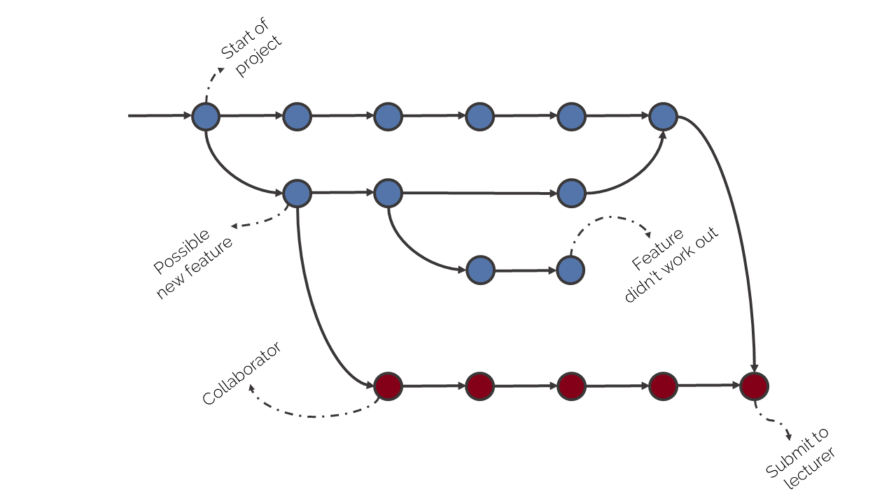

# Git

> I name all my projects after myself. First Linux, now git. - *Linus Torvalds*

There's a huge volume of information about [Git](https://git-scm.com/) online, a lot of it pitched to experienced developers.
It's difficult for new programmers to just learn the basics.
The Git community has even been accused of making Git obtuse on purpose.

> a revision control system which is expressly designed to make you feel less intelligent than you thought you were. - *Andrew Morton*

> git gets easier once you get the basic idea that branches are homeomorphic endofunctors mapping submanifolds of a Hilbert space. - *Isaac Wolkerstorfer‏*

I think that the real issue here is that Git attempts to solve a difficult problem: how to manage the development of software in which many people are involved.
Everybody understands that it is difficult to organise a team of people to solve a common problem.
Saying Git for being complex is like blaming the fireman for the fire.


## Use cases

Most college students have done the following two things when working on a project.

1. Backing up their project files by keeping a snapshot copy of them in a safe location. If there are many files involved, they usually zip up the containing folder and give it a name that includes the date. These snapshots of the project can be reverted to if something happens to the working copy of the project.

2. Emailing a copy of the project to collaborators. They zip up the project files and email it. Their collaborators unpack the zip file, edit the contents, zip up the project and email it back.

The two main downsides of the above approaches are that they are inefficient and they make it difficult to prevent two copies of the project becoming inconsistent with each other.
If you are still doing these with your software projects, then you need to start using Git.


## Repositories

Git uses the term *repository* to describe a folder on your computer that is managed by Git.
To turn a folder into a repository we use the `init` command.

```bash
C:\Users\mclou\repos\myrepo
$ git init

Initialized empty Git repository in C:/Users/mclou/repos/myrepo/.git/
```

Note that Git says it created a repository in a `.git` subfolder, as opposed to the current folder that I'm in.
Git creates a `.git` subfolder when you tell it to `init`.
That's where Git will store various data that it needs in tracking changes within the folder.

You might note that Git does not continuously run as a background process, but rather terminates after performing the `init`.
The `.git` subfolder is where Git keeps track of everything it has previously done.
Next time you run Git in this repository it will look in the subfolder to see what it has done before.
Effectively, `.git` is Git's working memory.


## Commits

The most fundamental concept in Git is a *commit*.
A commit is similar to a saved game in a video game.
You can generally think of a commit as a saved version of the repository files and folders.

The truth is a little more complex than that, however.
We construct a package of changes in the repository and then we tell Git to make a commit out of that package.
For example, we might create a package of the following changes.

1. Add the new file called `my-new-file.go`.
2. Add the new file called `LICENSE.md`.
3. Delete the file `tmp.txt`.
4. Rename the file 'README.dm' to 'README.md'.

These four changes can be made using the `git add`, `git rm` and `git mv` commands.
We call the construction of such a package *staging*.
We say that we added `my-new-file.go` to the staging area, for instance.

Once we are happy with all of the staged changes, we create a new commit.

```bash
C:\Users\mclou\repos\myrepo (master)
$ git commit -m "Re-organised the repo."

[master 68dcd9e] Re-organised the repo.
 3 files changed, 0 insertions(+), 0 deletions(-)
 rename README.dm => LICENSE.md (100%)
 rename tmp.txt => README.md (100%)
 create mode 100644 my-new-file.go
```

At any point, we can look through the past history of commits and see all of the changes we've made over the repository's history.
We can even `checkout` the previous versions of the repository in situ, and perhaps create a new, different [branch](https://www.atlassian.com/git/tutorials/using-branches) in the history of the project.



## Remotes

So far we have a way of keeping track of the changes to our repository but have not solved either of the two problems previously mentioned - backing up our repository and collaborating with others.
Most developers use [GitHub](http://www.github.com) to solve both of these problems.

Git allows us to create many copies of the same repository on many different machines.
It provides mechanisms to keep those copies synchronised, or even partially synchronised.
From the point-of-view of an individual copy of a repository, the other copies are called *remotes*.

We tell Git about remote copies using the `git remote` command, and supply a URL by which Git can access that remote copy.
Once we have told Git about a remote we can `pull` commits from it to view and use them locally, and we can `push` our commits to it.

This is where GitHub can help us.
Rather than keeping track of lots of remote copies of our project, distributed across the collaborators, we can use one central copy of the repository on GitHub.
Everyone can push and pull to and from that copy.
Furthermore, the GitHub copy can be used as a backup of our repository.


## Conflicts

What if two collaborators change the same file at the same time?
Suppose they both edit the file `my-new-file.go` in their own copies of the repository on the same day.
The first collaborator commits the change and pushes it up to GitHub.

The second collaborator then tries to do the same with their copy, but Git gives them an error.
They must first pull the commits from GitHub that they don't already have locally.
If Git cannot automatically figure out how to merge the changes already in GitHub with the local changes, then a merge conflict occurs and a human must intervene to decide what to do.

The good news is that, firstly, Git is pretty good at merging two different sets of changes together, even within the same file, and secondly, merge conflicts are usually straight-forward to fix.
You can usually avoid the situation, in any case, by regularly committing and pushing.
