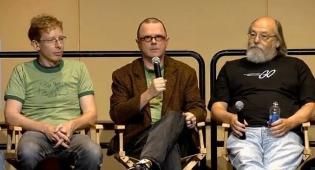
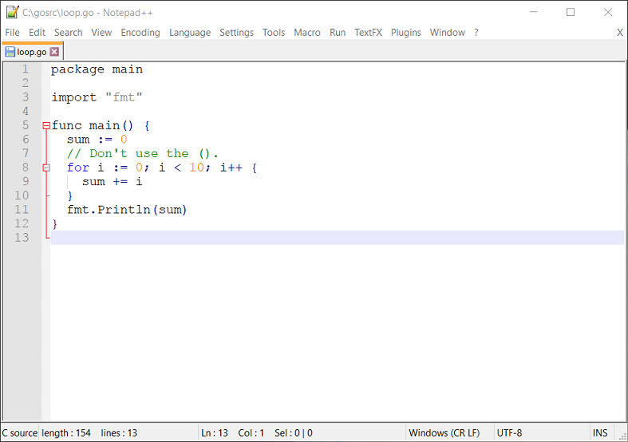
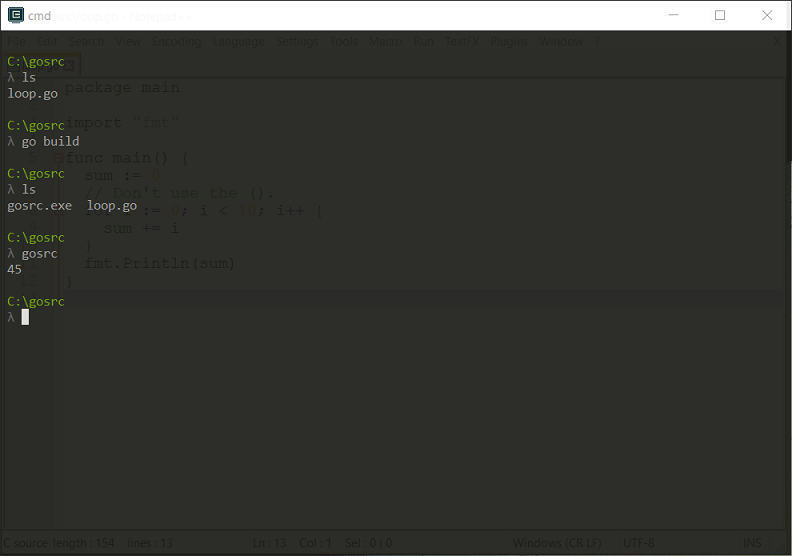

# The Go Programming Language
Before we dive into Go, let's quickly review programming in general.

## Purpose of a programming language
- Computers are really fast at carrying out a list of simple instructions.
- A processor can only carry out a limitied set of basic instruction (add, shift, etc.), but it can do them fast.
- Programming languages provide an abstraction from the processor.
- They allow programmers to think more like humans, rather than in terms of the machine.
- Consider the following C source code.

```c
#include <stdio.h>

int main() {
  printf("Hello, world!");
  return 0;
}
```

- The code is fairly easy to read from a human point of view (though you need to know a bit about programming).
- The line with the `printf` looks like a single instruction, but will actually result in the processor carrying out a few different instructions in sequence.
- Consider the equivalent assembly code (for Linux):

```assembly
global _start

section .text
_start:
  mov	eax, 4 ; write
  mov	ebx, 1 ; stdout
  mov	ecx, msg
  mov	edx, msg.len
  int	0x80   ; write(stdout, msg, strlen(msg));

  mov	eax, 1 ; exit
  mov	ebx, 0
  int	0x80   ; exit(0)

section .data
msg:	db	"Hello, world!", 10
.len:	equ	$ - msg
```

- You have to do a lot of mental decoding to figure out what it does (assuming you know assembly in the first place!)
- Assembly is a programming language, but it is a low-level one.
- This means that it is closer to the instructions that the processor carries out itself.
- Here's the punchline: programming languages save us from the nitty-gritty of how the computer works.


## What programs are
- I assume you already know a bit of programming.
- Consider various languages you might know: C, Java, C++, C#, Python, Go, Rust, HTML, JavaScript, XML, Markdown.
- What do they have in common?
- They're all written as text files.
- Every file on a computer is just a chunk of 0's and 1's.
- A text file is just a file that where the bytes represent human-style characters.
- A translation table is used to translate between the 0's and 1's and the squiggles on the screen (characters) that your monitor displays.
- A text editor reads all the 0's and 1's and translates them into squiggles on the screen.
- It also writes the correct 0's and 1's to memory for every key you press.
- There are lots of different translation tables these days, but the best known is still ASCII.
- In ASCII, for instance, the character a is represented by the 0's and 1's 01000001.

| Character | Binary   | Character | Binary   |
|-----------|----------|-----------|----------|
|     #     | 0100011  |     (     | 0101000  |
|     )     | 0101001  |     *     | 0101010  |
|     +     | 0101011  |     ,     | 0101100  |
|     :     |    :     |     :     |    :     |
|     :     |    :     |     :     |    :     |
|     a     | 01100001 |     A     | 01000001 |
|     b     | 01100010 |     B     | 01000010 |
|     c     | 01100011 |     C     | 01000011 |
|     :     |    :     |     :     |    :     |
|     :     |    :     |     :     |    :     |
|     w     | 01110111 |     W     | 01010111 |
|     x     | 01111000 |     X     | 01011000 |
|     y     | 01111001 |     Y     | 01011001 |
|     z     | 01111010 |     Z     | 01011010 |


## What compilers do
- A compiler/interpreter translates text files into machine instructions.
- You have to read the documentation for the compiler to know what syntax the text file must follow.
- A compiler does the translation and outputs file called an executable.
- An operating system knows how to take an executable file and run it through the processor.
- You can send the executable to your friend and they can run it, without having the source code or installing the compiler on their own machine - it just runs.
- An interpretor, on the other hand, translates the programming code into machine instructions and runs them there and then.
- It's like a compiler that immediately runs the executable and then throws it away.
- If you want to send your friend your interpretor-style program, you send them the source code and they have to have the interpretor installed on their machine to run it.
- So, it sounds like compilers should naturally win over interpretors - right?
- If you're writing software for non-programmers then usually the answer is yes.
- A big snag with compilers is that they target certain operating systems and machines. If I compile a program for Windows then my friend on a Mac can't run the executable.
- Another big snag is that my friend can't easily modify the program, as they don't have the source code.
- There are a lot of trade-offs. In truth, it's not quite as straight-forward as compiler versus interpretor. It's more of a spectrum - languages like Java are half-compiled, half-interpreted.


## Learning a new programming language
- The bad news is that programming languages go in and out fashion, and new programming languages come on the scene evrey couple of years. You'll have to learn to cope.
- The good news is that the common programming languages that people learn are very similar. Once you learn one, the others are super-easy to learn.
- (The superbad and supergood news is that functional programming is back with a bang, but we'll cover that next year.)
- There are a lot of technical trade-offs between various programming languages, making certain ones better suited to certain tasks.
- Really though, you don't need to worry about that when you're just getting started.
- All you need to know about is the language's syntax.


## Common programming language essentials
If you can do all of these in a (imperative) programming language then you know most of it:

- Variables
- Conditionals
- Loops
- Functions
- Objects?
- Comments

In the next few sections we'll see how to do ths in Go.


## Back to Go
[Go](https://golang.org/) is a programming language created by Robert Griesemer, Rob Pike, and Ken Thompson at Google.
Ken Thompson and Rob Pike worked at the famous Bell Labs.

 


## Go features
- **Concurrency** is builtin with light-weight goroutines, channels.  
- **Fast compiling** is a goal.
- **Packages** are easily managed and dependencies are quickly resolved.
- **Type inference** is available (sometimes).
- **C-like** in syntax. 
- **Tools** like go fmt and godoc are builtin. 
- **Garbage collection** is builtin.


## Hello, world!
Here's the usual program in G.
```go
// https://gobyexample.com/hello-world

package main

import "fmt"

func main() {
  fmt.Println("Hello, world!")
}
```

- You can see the starting function is called `main`, just like in C.
- `fmt` is Go's standard Input/Output library. It's imported with an `import` statement.
- The first line is a comment.
- The file belongs to the package `main`.
- Functions look like C functions, but instead of the return type they begin with the keyword `func`.
- Strings are enclosed in double quotes.
- In the next few sections we'll go through the essentials.

## Variables
```go
package main

import "fmt"

func main() {
    // `var` declares 1 or more variables.
    var a string = "initial"
    fmt.Println(a)

    // You can declare multiple variables at once.
    var b, c int = 1, 2
    fmt.Println(b, c)

    // Go will infer the type of initialized variables.
    var d = true
    fmt.Println(d)

    // Variables declared without a corresponding
    // initialization are _zero-valued_. For example, the
    // zero value for an `int` is `0`.
    var e int
    fmt.Println(e)

    // The `:=` syntax is shorthand for declaring and
    // initializing a variable, e.g. for
    // `var f string = "short"` in this case.
    f := "short"
    fmt.Println(f)
}
```
https://play.golang.org/p/Zv45CSMaiD


## if and else
```go
package main

import "fmt"

func main() {
  if 7 % 2 == 0 {
    fmt.Println("7 is even")
  } else {
    fmt.Println("7 is odd")
  }

  // You can have an `if` statement without an else.
  if 8 % 4 == 0 {
    fmt.Println("8 is divisible by 4")
  }

  // A statement can precede conditionals; any variables
  // declared in this statement are available in all
  // branches.
  if num := 9; num < 0 {
    fmt.Println(num, "is negative")
  } else if num < 10 {
    fmt.Println(num, "has 1 digit")
  } else {
    fmt.Println(num, "has multiple digits")
  }
}
```

https://play.golang.org/p/g-aqMz0Ivf

## for loops
```go
package main

import "fmt"

func main() {
  sum := 0
  // Don't use the ().
  for i := 0; i < 10; i++ {
    sum += i
  }
  fmt.Println(sum)
}
```

https://tour.golang.org/flowcontrol/1


## Functions
```go
package main

import "fmt"

// Use the func keyword.
// Arguments have type after name.
// Return type(s) come last.
func add(x int, y int) int {
  return x + y
}

func main() {
  fmt.Println(add(42, 13))
}
```

https://tour.golang.org/basics/4


## Compiling Go code
- Go is pretty opinionated about how you should write your code.
- Luckily, Go provides a tool called `go` that manages lots of things for us.
- For instance, we can use go to compile a program.





